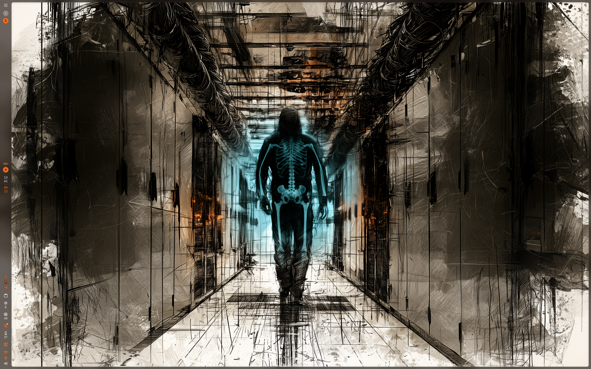

# Xray Wallpaper

**English** · [Deutsch](README.de.md) · [Español](README.es.md) · [Français](README.fr.md) · [Italiano](README.it.md) · [Português](README.pt.md) · [Русский](README.ru.md) · [日本語](README.ja.md) · [简体中文](README.zh_CN.md)

A plugin for [DankMaterialShell](https://github.com/AvengeMedia/DankMaterialShell) that keeps a second picture behind your wallpaper. Around the pointer the wallpaper has a soft hole, and the picture shows through it.



Step by step with pictures: [installation and setup guide](docs/GUIDE.md).

## What it does

Your DMS wallpaper stays where it is. The plugin draws the picture you pick on a see-through surface above it: inside the hole around the pointer, and nowhere else. Everything it does not draw stays clear, so wallpaper transitions, desktop widgets and other background plugins keep working.

On the desktop the hole follows the pointer; move the pointer away from the desktop and the hole closes.

Over a window the pointer belongs to that window, so there is a second way in: the peek mode. It opens a round view of the picture above all windows, follows the pointer everywhere and ends on a click, after a few seconds, or when you let go of the key you hold.

There is a third way on niri: "Follow behind the windows" reads the pointer position from niri's IPC socket, and the hole keeps running behind the windows, seen wherever they are see-through. niri does not hand out the pointer position on its own, so this needs a niri with a patch of mine (see below). With a normal niri the switch stays hidden and the two ways above work as usual.

"Upper layer opacity" below 100 % lets the picture through across the whole screen, which turns the whole thing into a blend of two pictures with a clear spot around the pointer. With "Second image on top" the picture covers the wallpaper instead and the hole shows the wallpaper. The hole size, the softness of its edge, an optional ring of light and how fast the hole follows can all be set. "Hole strength" below 100 % opens the hole only partly, so the picture shows through around the pointer without replacing the wallpaper there, for example a circuit board behind a normal wallpaper.

The picture is mapped like the DMS wallpaper, so stretch, fit and crop look the same as for your wallpaper.

## Requirements

DankMaterialShell 1.6.1 or newer. I use it on niri. Everything works with a normal niri except "Follow behind the windows", which needs a patched niri, see [Following behind the windows](#following-behind-the-windows).

On niri, background surfaces move with the workspaces unless they sit in the backdrop. Add this to your niri config, otherwise the picture scrolls away when you switch workspaces:

```kdl
layer-rule {
    match namespace="^xray-wallpaper$"
    place-within-backdrop true
}
```

## Installation

From the plugin registry:

```sh
dms plugins install xrayWallpaper
dms ipc call plugins enable xrayWallpaper
```

It is also listed in DMS under Settings → Plugins → Browse. To install from the repository instead:

```sh
git clone https://github.com/satoshoe-dev/dms-xray-wallpaper ~/.config/DankMaterialShell/plugins/XrayWallpaper
dms ipc call plugins enable xrayWallpaper
```

Then pick the second picture in Settings → Plugins → Xray Wallpaper. Until it is set, nothing changes on screen.

## Settings

Settings → Plugins → Xray Wallpaper

| Setting | Default |
|---|---|
| Second image | none |
| Second image on top | off |
| Hole size | 260 px |
| Soft edge | 90 px |
| Glowing ring | 0 px (off) |
| Ring color | accent |
| Upper layer opacity | 100 % |
| Hole strength | 100 % |
| Darken the upper / lower layer | 0 % / 0 % |
| Follow speed | 4000 px/s |
| Follow on the desktop | on |
| Follow behind the windows | off |
| Hold mode: stay on after the key | 800 ms |
| End peek mode after | 20 s |

## IPC

```sh
dms ipc call xray peek toggle     # round view above the windows, also on|off
dms ipc call xray hold            # the same, but only while a key is held
dms ipc call xray at 1280 800     # put the hole at a fixed spot
dms ipc call xray close           # close it again
dms ipc call xray status
dms ipc call xray set radius 400  # any setting from the table above
```

Keybinds in niri, one as a switch and one to hold:

```kdl
binds {
    Mod+Shift+X { spawn "dms" "ipc" "call" "xray" "peek" "toggle"; }
    Mod+Alt+X cooldown-ms=150 { spawn "dms" "ipc" "call" "xray" "hold"; }
}
```

The hold bind works through the key repeat: every repeat pushes the end a little further, and shortly after you let go the view closes. If it flickers while you hold the key, raise "Hold mode: stay on after the key".

## Following behind the windows

Wayland delivers pointer motion only to the surface under the pointer, so no client can follow it once a window is in the way. niri knows the position but does not publish it.

The pointer stream is a patch of mine for niri and is not part of niri. It adds a separate `PointerStream` request to the IPC that sends `PointerMoved` events, so clients that do not ask for it never see them. With a niri built with this patch the switch works. A normal niri answers the request with an error; the plugin remembers that and stays with the desktop sensor and the peek mode. The settings page then hides the switch, and everything else works as described above.

The patch against niri 26.04 is in the branch [pointer-stream-v26.04](https://github.com/satoshoe-dev/niri/tree/pointer-stream-v26.04) of my niri fork. It builds like niri itself, see the niri README.

## Translations

The settings page is available in German, Spanish, French, Italian, Portuguese, Russian, Japanese and Simplified Chinese and follows the language set in DMS. If a translation reads wrong, a pull request is welcome.

## Note

I wrote this plugin with help from Claude (Anthropic) and tested every change on my own niri desktop.

## License

MIT
