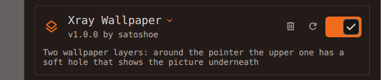
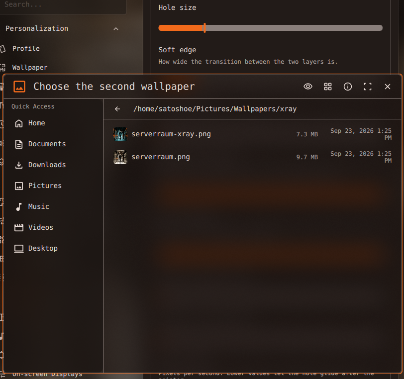
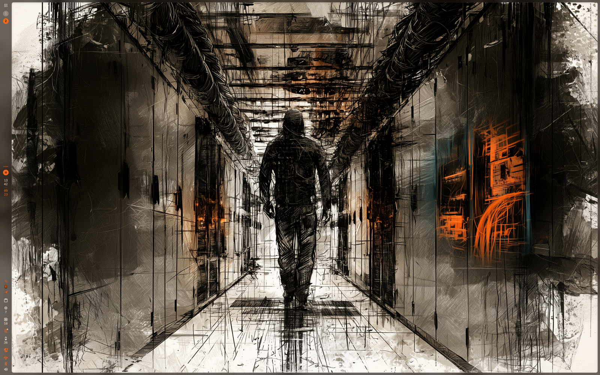
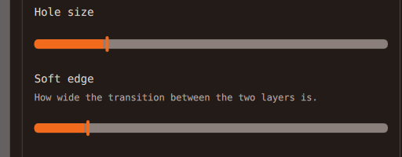
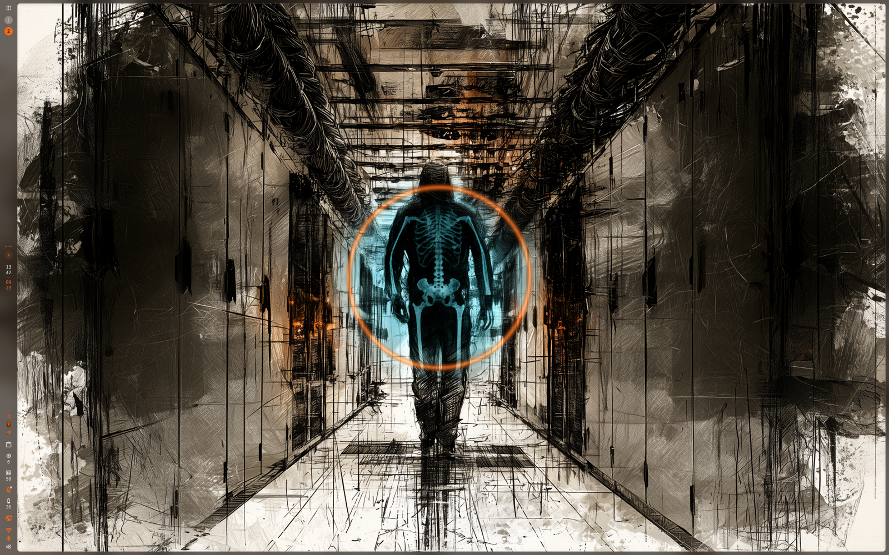
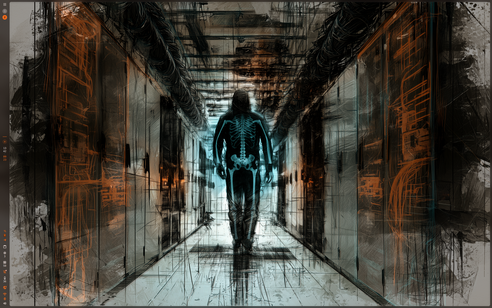
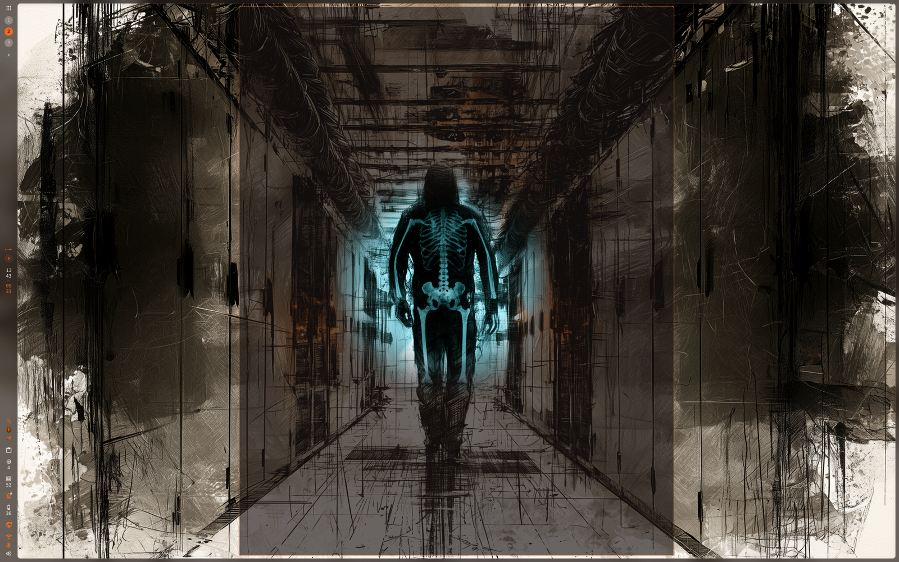
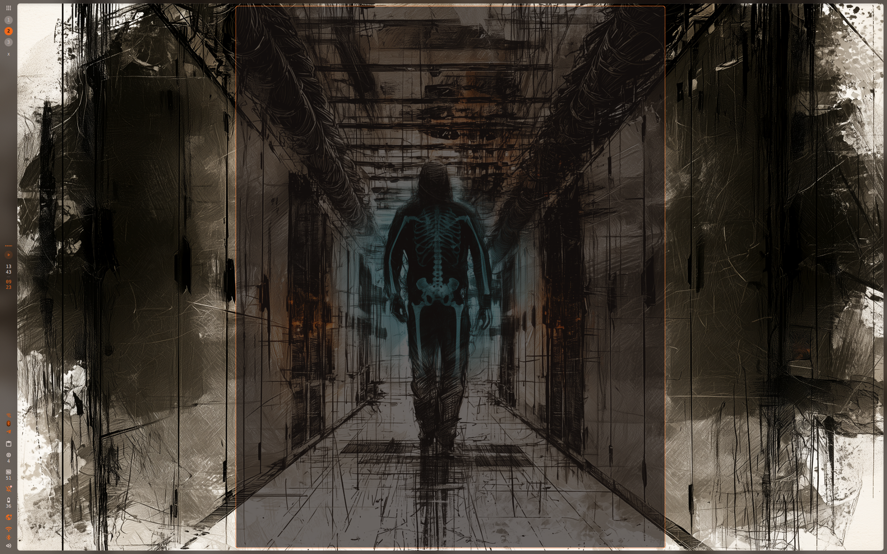

# Xray Wallpaper: 手順

[English](GUIDE.md) · [Deutsch](GUIDE.de.md) · [Español](GUIDE.es.md) · [Français](GUIDE.fr.md) · [Italiano](GUIDE.it.md) · [Português](GUIDE.pt.md) · [Русский](GUIDE.ru.md) · **日本語** · [简体中文](GUIDE.zh_CN.md)

## 1. プラグインを入れる

プラグインレジストリから:

```sh
dms plugins install xrayWallpaper
```

または、リポジトリを DMS のプラグインフォルダーにクローンします。

```sh
git clone https://github.com/satoshoe-dev/dms-xray-wallpaper ~/.config/DankMaterialShell/plugins/XrayWallpaper
```

## 2. 有効にする

設定 → プラグイン を開きます。一覧に Xray Wallpaper が出てきます。オンにしてください。



出てこないときは、そのページの「スキャン」を押すか、`dms restart` でシェルを再起動します。

## 3. niri では: レイヤーを backdrop に置く

niri では背景のサーフェスがワークスペースと一緒に動きます。画像が動かないように、次を `~/.config/niri/config.kdl` に足してください。

```kdl
layer-rule {
    match namespace="^xray-wallpaper$"
    place-within-backdrop true
}
```

niri はファイルを保存するとすぐに変更を読み込みます。

## 4. 2 枚目の画像を選ぶ

プラグイン一覧で Xray Wallpaper を開き、「画像を選ぶ」を押します。ファイル選択が画像フォルダーで開きます。



壁紙はそのままで、選んだ画像が穴から見えます。選ぶまで画面は何も変わりません。

## 5. デスクトップでポインターを動かす

デスクトップの空いているところにポインターを持っていきます。ポインターのある場所に穴が開き、そのまま付いてきます。



ポインターをウィンドウの上に移すと、穴はまた閉じます。

## 6. 大きさとふちを決める

「穴の大きさ」は半径をピクセルで指定します。「ふちのぼかし」は 2 枚のレイヤーが混ざる幅です。ぼかしを広くするとランプが透けているように、狭くすると切り抜きのように見えます。



「追従の速さ」は穴がポインターにどれだけぴったり付くかを決めます。4000 px/s なら遅れずに付いてきて、800 px/s なら後ろから滑ってきます。

## 7. 光の輪を足す (任意)

「光るリング」は穴のふちに光を描きます。色はアクセントか文字の色です。



## 8. 画像を全体に透かす (任意)

「上のレイヤーの不透明度」は壁紙をどれだけ残すかを決めます。100 % なら画像は穴の中だけに見えます。下げると画像は画面全体に透けてきて、穴だけが完全に見えている場所になります。

「穴の強さ」は逆の働きをします。壁紙はそのままで、穴が一部だけ開きます。60 % ならポインターのまわりで画像が 60 % 透けて見えます。普通の壁紙の裏に基板の画像を置くと、ポインターを動かしたところでうっすら透けて見えます。



2 枚のレイヤーはそれぞれ別に暗くもできます。上を暗くすると穴が目立ち、下を暗くするとアイコンの後ろの画像が落ち着きます。

## 9. ウィンドウの向こうを見る

ウィンドウの上ではポインターはそのウィンドウのものなので、デスクトップのセンサーには見えません。代わりに peek モードが、下の画像の丸い窓をすべてのウィンドウの上に置きます。

```sh
dms ipc call xray peek toggle
```



クリックで終わり、「peek モードを終える時間」のタイマーでも終わります。キーに割り当てるなら、niri では:

```kdl
binds {
    Mod+Shift+X hotkey-overlay-title="Xray: look through the wallpaper" { spawn "dms" "ipc" "call" "xray" "peek" "toggle"; }
}
```

押している間だけ見たいなら、2 つ目のコマンドを使います。

```kdl
binds {
    Mod+Alt+X cooldown-ms=150 hotkey-overlay-title="Xray: look while held" { spawn "dms" "ipc" "call" "xray" "hold"; }
}
```

こちらはキーリピートに乗っています。リピートのたびに終わりが少しずつ先へ延び、キーを放すとすぐに窓は閉じます。押している間にちらつくときは、設定の「押している間: キーのあとの余韻」を大きくしてください。

## 10. ウィンドウの裏でも追従する (パッチを当てた niri のみ)

Wayland はポインターの動きを、その下にあるサーフェスにしか渡しません。手順 5 と手順 9 があるのはそのためです。niri は位置を知っていますが、外には出しません。私が書いたパッチ (niri 本体には入っていません) が niri の IPC ソケットにポインターストリームを足し、プラグインはそこから位置を受け取れます。通常の niri ではこの手順は飛ばしてください。このガイドのほかの部分はパッチなしで動きます。どちらの niri かは次で確かめられます。

```sh
niri msg pointer-stream      # prints positions while you move the mouse
```

これで座標が流れてくるなら、「ウィンドウの裏でも追従する」をオンにしてください。穴はどこでも、ウィンドウの裏でも動くようになり、ウィンドウが透けているところに現れます。niri がこのコマンドを知らないときは、その niri にポインターストリームがないので、スイッチは表示されません。



## 11. レイヤーを入れ替える

「2 枚目の画像を上に」を入れると、自分の画像が上のレイヤーになり、穴から DMS の壁紙が見えます。ふだん見ていたいのが 2 枚目のほうなら便利です。たとえば壁紙の暗い版を上に置き、明るい元の画像を下に置く使い方です。

## 12. スクリプトから

```sh
dms ipc call xray at 1280 800     # hole at a fixed spot
dms ipc call xray close           # close it again
dms ipc call xray set radius 400  # change any setting
dms ipc call xray status
```

## 困ったとき

### ワークスペースを切り替えるとレイヤーが流れていく

手順 3 の niri のレイヤールールがありません。

### デスクトップで穴が付いてこない

「デスクトップで追従する」がオフか、その場所をウィンドウが覆っています。センサーはデスクトップが空いているところでしかポインターを見られません。

### まったく何も変わらない

2 枚目の画像がまだ設定されていないか、ファイルがなくなっています。設定ページに使っているパスが出ています。

### デスクトップウィジェットが反応しなくなった

センサーはウィジェットの下にあるので、そうなるはずはありません。もし起きたら「デスクトップで追従する」をオフにして、peek モードを使ってください。

### 「ウィンドウの裏でも追従する」を入れても何も変わらない

動いている niri はポインターストリームのパッチなしでビルドされています。そのとき `dms ipc call xray status` は `"stream":"refused"` と返し、プラグインはセンサーと peek モードのままです。

### 押しているキーでちらつく

キーリピートが「押している間: キーのあとの余韻」より遅くなっています。この値を大きくするか、キーボードのリピート開始を短くしてください。
