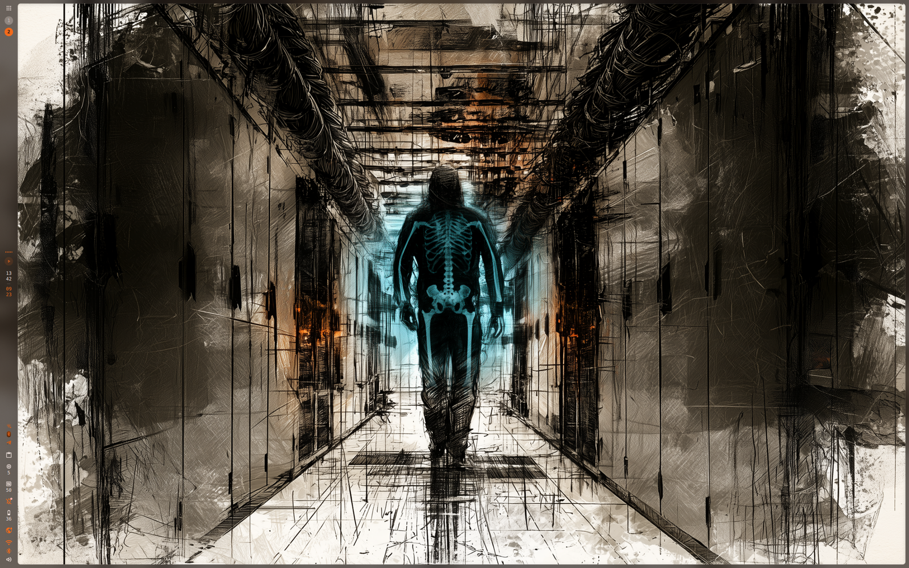

# Xray Wallpaper: passo a passo

[English](GUIDE.md) · [Deutsch](GUIDE.de.md) · [Español](GUIDE.es.md) · [Français](GUIDE.fr.md) · [Italiano](GUIDE.it.md) · **Português** · [Русский](GUIDE.ru.md) · [日本語](GUIDE.ja.md) · [简体中文](GUIDE.zh_CN.md)

## 1. Instalar o plugin

Pelo registro de plugins:

```sh
dms plugins install xrayWallpaper
```

Ou clone o repositório na sua pasta de plugins do DMS:

```sh
git clone https://github.com/satoshoe-dev/dms-xray-wallpaper ~/.config/DankMaterialShell/plugins/XrayWallpaper
```

## 2. Ativá-lo

Abra Configurações → Plugins. O Xray Wallpaper aparece na lista. Ative-o.


Se ele não aparecer, clique em “Escanear” nessa página ou reinicie o shell com `dms restart`.

## 3. No niri: manter as camadas no backdrop

No niri as superfícies de fundo se movem com os espaços de trabalho. Adicione isto a `~/.config/niri/config.kdl` para que a imagem fique no lugar:

```kdl
layer-rule {
    match namespace="^xray-wallpaper$"
    place-within-backdrop true
}
```

O niri aplica a mudança assim que você salva o arquivo.

## 4. Escolher a segunda imagem

Expanda o Xray Wallpaper na lista de plugins e clique em "Escolher imagem". O explorador de arquivos abre na sua pasta de imagens.


O seu papel de parede fica onde está; a imagem que você escolhe aparece no buraco. Enquanto você não escolher uma, nada muda na tela.

## 5. Passar o ponteiro pela área de trabalho

Leve o ponteiro para um lugar livre da área de trabalho. O buraco abre onde está o ponteiro e o segue.


Leve o ponteiro para cima de uma janela e o buraco se fecha de novo.

## 6. Ajustar o tamanho e a borda

"Tamanho do buraco" é o raio em pixels, "Borda suave" a largura em que as duas camadas se misturam. Uma borda suave larga parece uma lâmpada brilhando por trás, uma estreita parece um recorte.


"Velocidade de seguimento" decide o quanto o buraco gruda no ponteiro. A 4000 px/s ele acompanha, a 800 px/s desliza atrás dele.

## 7. Acrescentar um anel de luz (opcional)

"Anel luminoso" desenha luz na borda do buraco, na sua cor de destaque ou na cor do texto.


## 8. Deixar passar a imagem em toda parte (opcional)

"Opacidade da camada de cima" decide quanto sobra do papel de parede. A 100 % a imagem só aparece no buraco. Abaixe o valor e a imagem passa pela tela inteira, com o buraco como o único lugar onde ela está inteira.


"Intensidade do buraco" faz o contrário. Deixa o papel de parede como está e abre o buraco só em parte: a 60 % a imagem aparece em volta do ponteiro a 60 %. Uma placa de circuito atrás de um papel de parede normal aparece então de leve onde você move o ponteiro.



As duas camadas também podem ser escurecidas separadamente. Escurecer a de cima faz o buraco saltar aos olhos; escurecer a de baixo mantém a imagem calma por trás dos seus ícones.

## 9. Ver através das janelas

Sobre uma janela o ponteiro pertence a essa janela, então o sensor da área de trabalho não o vê. Em vez disso, o modo peek coloca uma vista redonda da imagem de baixo acima de todas as janelas:

```sh
dms ipc call xray peek toggle
```


Um clique o encerra, e o temporizador em "Terminar o modo peek após" também. Coloque-o em uma tecla, no niri:

```kdl
binds {
    Mod+Shift+X hotkey-overlay-title="Xray: look through the wallpaper" { spawn "dms" "ipc" "call" "xray" "peek" "toggle"; }
}
```

Se você preferir ver só enquanto segura uma tecla, use o segundo comando:

```kdl
binds {
    Mod+Alt+X cooldown-ms=150 hotkey-overlay-title="Xray: look while held" { spawn "dms" "ipc" "call" "xray" "hold"; }
}
```

Este se apoia na repetição da tecla: cada repetição empurra o fim um pouco mais para a frente, e pouco depois de você soltar, a vista se fecha. Se tremer enquanto você segura a tecla, aumente "Manter: tempo depois da tecla" nas configurações.

## 10. Seguir por trás das janelas (só com niri com o patch)

O Wayland só entrega o movimento do ponteiro à superfície que está embaixo dele, e é por isso que os passos 5 e 9 existem. O niri conhece a posição, mas não a fornece. Um patch que eu escrevi, e que não faz parte do niri, adiciona um fluxo do ponteiro ao socket IPC do niri, e o plugin pode pegar a posição de lá. Com um niri normal, pule este passo; todo o resto deste guia funciona sem o patch. Para ver qual niri você tem:

```sh
niri msg pointer-stream      # prints positions while you move the mouse
```

Se aparecerem posições, ative "Seguir por trás das janelas". O buraco então passa a correr em toda parte, também por trás das janelas, e aparece onde uma janela for translúcida. Se o niri não conhecer o comando, o seu niri não tem o fluxo do ponteiro e o interruptor não aparece.


## 11. Trocar as camadas

Com "Segunda imagem em cima" a sua imagem passa a ser a camada de cima e o buraco mostra o papel de parede do DMS. Útil se a segunda imagem for a que você quer ver na maior parte do tempo, por exemplo uma versão escura do seu papel de parede com o original claro por baixo.

## 12. Usá-lo em scripts

```sh
dms ipc call xray at 1280 800     # hole at a fixed spot
dms ipc call xray close           # close it again
dms ipc call xray set radius 400  # change any setting
dms ipc call xray status
```

## Solução de problemas

### As camadas desaparecem quando mudo de espaço de trabalho

Falta a regra de layer do niri do passo 3.

### O buraco não segue na área de trabalho

"Seguir na área de trabalho" está desligado, ou uma janela cobre esse lugar. O sensor só vê o ponteiro onde a área de trabalho está livre.

### Não muda nada

Ainda não há nenhuma segunda imagem definida, ou o arquivo sumiu; a página de configurações mostra o caminho que usa.

### Um widget da área de trabalho parou de reagir

O sensor fica sob os widgets, então isso não deveria acontecer. Se acontecer, desligue "Seguir na área de trabalho" e use o modo peek.

### "Seguir por trás das janelas" não muda nada

O niri em execução foi compilado sem o patch do fluxo do ponteiro. Nesse caso `dms ipc call xray status` mostra `"stream":"refused"`, e o plugin fica só com o sensor e o modo peek.

### A tecla pressionada treme

A repetição da tecla é mais lenta que o tempo em "Manter: tempo depois da tecla". Aumente-o, ou reduza o atraso de repetição do seu teclado.
